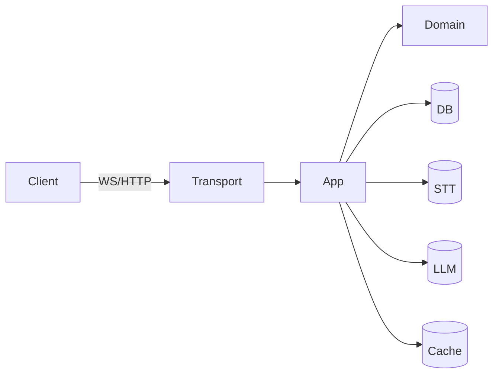

# Architecture Overview

## You'll learn

-   How the hexagonal boundaries are enforced.
-   What each layer owns and depends on.
-   Known deviations and planned refactors.

## Where this lives in hex

Repository-wide; applies to domain/app/infra/transport/pkg.

## System Context (Mermaid)

## Allowed Dependencies

-   domain: imports none outside stdlib
-   app: imports domain
-   infra: imports domain (adapters), may be imported by app
-   transport: imports app (use-cases) and DTO mappers
-   pkg: utility, no business rules

## Import-graph violations

-   [ ] TODO: Analyze codebase for import violations
-   [ ] TODO: Document any violations found with file:line references

## Key Decisions

-   [ ] TODO: Create and link ADR-0001-hex-architecture.md
