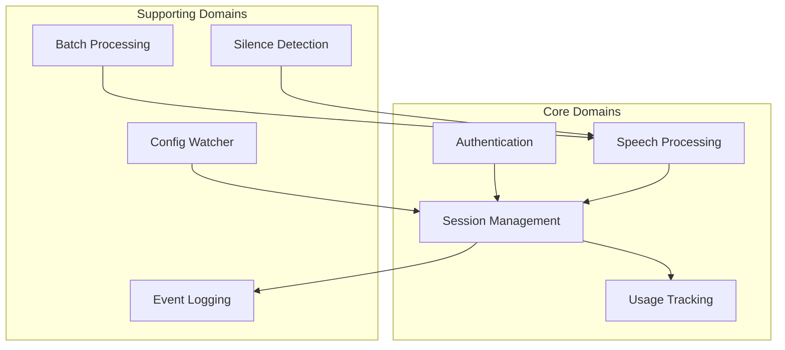

# Domain Layer

## You'll learn

-   Core domain models and business rules
-   Domain service interactions
-   Pure business logic implementation

## Where this lives in hex

Core domain layer; contains business rules and types with no external dependencies.

## Domain Overview



## Core Domains

### Authentication Domain

-   Account and user models
-   Role-based access control
-   Permission validation
-   API key management

### Session Management

-   Session lifecycle
-   State transitions
-   Resource allocation
-   Cleanup policies

### Speech Processing

-   Audio stream handling
-   Transcript management
-   Function detection
-   Output formatting

### Usage Tracking

-   Resource consumption
-   Rate limiting
-   Quota management
-   Cost calculation

## Supporting Domains

### Batch Processing

-   Job scheduling
-   Resource management
-   Progress tracking
-   Error handling

### Configuration Management

-   Dynamic configuration
-   Hot reloading
-   Validation rules
-   Default values

### Event Logging

-   Event types
-   Audit trail
-   Event filtering
-   Retention policies

### Silence Detection

-   Audio analysis
-   Threshold management
-   Segment identification
-   Stream optimization

## Domain Rules

### Authentication Rules

1. API keys must be validated before session creation
2. Roles determine feature access
3. Account status affects service availability

### Session Rules

1. One active audio stream per session
2. Resource limits based on account tier
3. Automatic cleanup after inactivity
4. State transitions must be valid

### Processing Rules

1. Audio format validation
2. Transcript finalization conditions
3. Function detection confidence thresholds
4. Output schema validation

### Usage Rules

1. Resource quotas by account tier
2. Rate limiting by endpoint
3. Cost calculation formulas
4. Usage aggregation rules

## Value Objects

### Common Types

```go
type SessionID string
type AccountID string
type AppID string
type UserID string

type SessionType string
const (
    TypeStructuredOutput SessionType = "structured_output"
    TypeFunctions       SessionType = "functions"
    TypeEnhancedText   SessionType = "enhanced_text"
    TypeMarkdown       SessionType = "markdown"
)

type SessionState string
const (
    StateInitializing SessionState = "initializing"
    StateActive       SessionState = "active"
    StatePaused       SessionState = "paused"
    StateFinalizing   SessionState = "finalizing"
    StateClosed       SessionState = "closed"
)
```

### Domain Events

```go
type Event interface {
    EventType() string
    Timestamp() time.Time
    SessionID() SessionID
}

type TranscriptEvent struct {
    Type      string
    Text      string
    IsFinal   bool
    Timestamp time.Time
}

type FunctionEvent struct {
    Type       string
    FunctionID string
    Name       string
    Args       map[string]interface{}
    Confidence float64
}
```

## Error Types

### Domain Errors

```go
var (
    ErrInvalidSession     = errors.New("invalid session")
    ErrSessionClosed      = errors.New("session closed")
    ErrInvalidTransition  = errors.New("invalid state transition")
    ErrQuotaExceeded     = errors.New("quota exceeded")
    ErrInvalidInput      = errors.New("invalid input")
)
```

### Error Categories

1. Validation Errors

    - Invalid input format
    - Schema violations
    - Business rule violations

2. State Errors

    - Invalid transitions
    - Resource unavailable
    - Timeout conditions

3. Resource Errors
    - Quota exceeded
    - Rate limit reached
    - Resource exhausted

## Testing Strategy

### Unit Testing

-   Pure function testing
-   State transition validation
-   Business rule verification
-   Error case coverage

### Property Testing

-   Input validation
-   State machine properties
-   Invariant checking
-   Boundary testing

### Test Data

-   Test factories
-   Common fixtures
-   State builders
-   Error scenarios
