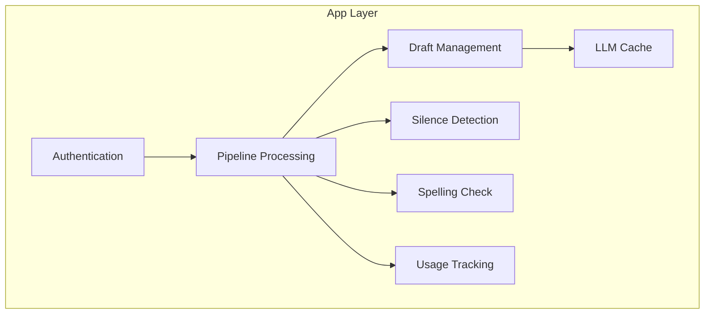

# Orchestration Policies

## You'll learn

-   How different app components work together
-   Pipeline processing and batch handling
-   Usage tracking and resource management

## Where this lives in hex

App layer; orchestrates domain logic and infrastructure services.

## Component Overview

## Authentication Flow

-   [ ] TODO: Document auth component responsibilities
-   [ ] TODO: Document auth flow sequence

## Pipeline Processing

### Audio Pipeline

-   [ ] TODO: Document audio chunk processing
-   [ ] TODO: Document silence detection integration

### Text Processing

-   [ ] TODO: Document draft generation
-   [ ] TODO: Document spelling correction

## Resource Management

### Batch Processing

-   [ ] TODO: Document batch job handling
-   [ ] TODO: Document scheduling policies

### Usage Tracking

-   [ ] TODO: Document usage metrics
-   [ ] TODO: Document rate limiting

## Caching Strategy

### LLM Cache

-   [ ] TODO: Document cache key generation
-   [ ] TODO: Document invalidation rules

### Performance Optimization

-   [ ] TODO: Document memory management
-   [ ] TODO: Document cleanup policies

## Error Handling

### Recovery Policies

-   [ ] TODO: Document error recovery
-   [ ] TODO: Document fallback strategies

### Monitoring

-   [ ] TODO: Document health checks
-   [ ] TODO: Document alerting rules

## Development Guidelines

### Adding New Components

-   [ ] TODO: Document component integration
-   [ ] TODO: Document testing requirements

### Testing Strategy

-   [ ] TODO: Document unit test approach
-   [ ] TODO: Document integration tests
