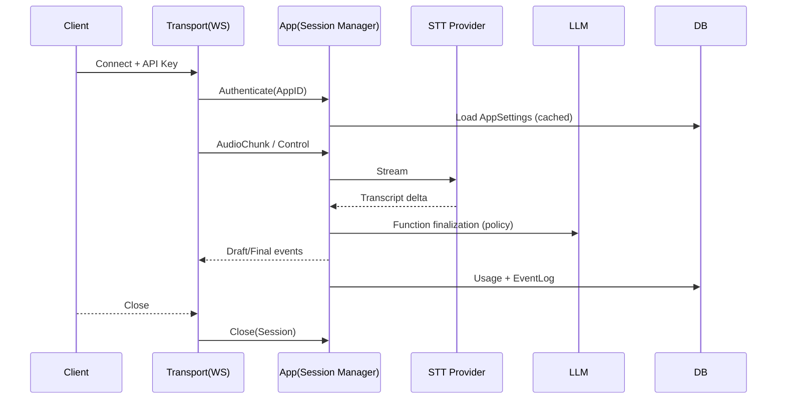

# Session Manager

## You'll learn

-   Use-cases (`Start`, `Advance`, `AddUsage`, `Snapshot`, `Close`).
-   Invariants, retries, and idempotency.
-   Sequence across WS events.

## Where this lives in hex

App layer orchestration.

## Ports and Methods

-   [ ] TODO: Document Start method and parameters
-   [ ] TODO: Document Advance method and parameters
-   [ ] TODO: Document AddUsage method and parameters
-   [ ] TODO: Document Snapshot method and parameters
-   [ ] TODO: Document Close method and parameters

## Sequence (connect → close)

## Failure Modes & Policies

-   [ ] TODO: Document rate limiting configuration
-   [ ] TODO: Document backpressure mechanisms
-   [ ] TODO: Document retry policies for STT/LLM/DB
-   [ ] TODO: Document idempotency key implementation
