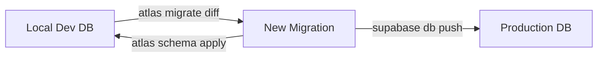
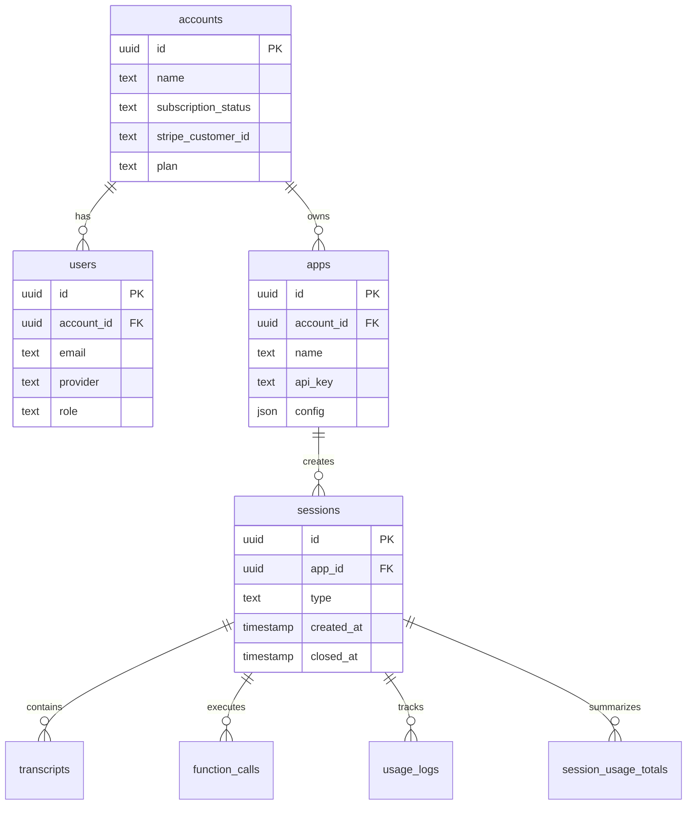

# Database Infrastructure

## You'll learn

-   Database schema management with Atlas
-   Migration workflows and practices
-   Data access patterns and SQLC usage

## Where this lives in hex

Infrastructure layer; provides data persistence adapters for the domain.

## Schema Management

### Atlas Schema

The database schema is managed using Atlas, with the main schema definition in `internal/infra/db/schema.hcl`. The schema follows a multi-tenant design with accounts, users, and apps.

### Migration Workflow

As seen in the Makefile, we follow this migration process:



### Key Commands

-   `make db-migrate name=<name>` - Generate new migration
-   `make db-generate` - Generate SQLC models
-   `make db-apply` - Apply to development DB
-   `make db-sync` - Sync to Supabase

## Database Schema

### Core Tables and Relationships



### Key Table Groups

1. **Authentication & Authorization**

    - `accounts` - Multi-tenant root
    - `users` - User accounts with provider integration
    - `roles` - RBAC roles
    - `permissions` - Granular permissions
    - `role_users` - Role assignments

2. **Application Management**

    - `apps` - Client applications
    - `function_schemas` - Function definitions
    - `structured_output_schemas` - Output schemas

3. **Session & Processing**

    - `sessions` - Processing sessions
    - `transcripts` - Speech transcriptions
    - `function_calls` - Function executions
    - `structured_outputs` - Structured results

4. **Usage & Billing**
    - `usage_logs` - Detailed usage tracking
    - `session_usage_totals` - Aggregated metrics
    - `draft_function_stats` - Function analytics

### Indexes and Performance

1. **Primary Lookup Paths**

    - Account lookups: `stripe_customer_idx`
    - User authentication: `account_user_idx`, `provider_idx`
    - API key validation: `apps(api_key)`

2. **Analytics Indexes**
    - Usage tracking: `usage_logs_by_app_type_time`
    - Function analytics: `draft_aggs_app_function_idx`
    - Session metrics: Various session-related indexes

## Data Access Patterns

### SQLC Integration

SQLC is used to generate type-safe Go code from SQL queries. Key patterns:

1. **Query Organization**

    - Queries grouped by domain entity
    - Generated models in separate package
    - Transaction support via interfaces

2. **Common Operations**
    - Account/User lookup
    - Session management
    - Usage tracking
    - Analytics aggregation

### Connection Management

1. **Pool Configuration**

    ```go
    type Config struct {
        MaxOpenConns    int
        MaxIdleConns    int
        ConnMaxLifetime time.Duration
    }
    ```

2. **Transaction Patterns**
    - Session creation with usage tracking
    - Batch function processing
    - Usage aggregation

## Development Workflow

### Local Setup

1. PostgreSQL runs in Supabase
2. Connection via `DATABASE_URL`
3. Migrations applied via Atlas

### Testing

1. Separate test database
2. Fixtures via testcontainers
3. Transaction rollback pattern

## Monitoring and Maintenance

### Health Checks

-   Connection pool metrics
-   Query performance tracking
-   Lock monitoring

### Backup Strategy

-   Supabase automated backups
-   Point-in-time recovery
-   Retention policy management
