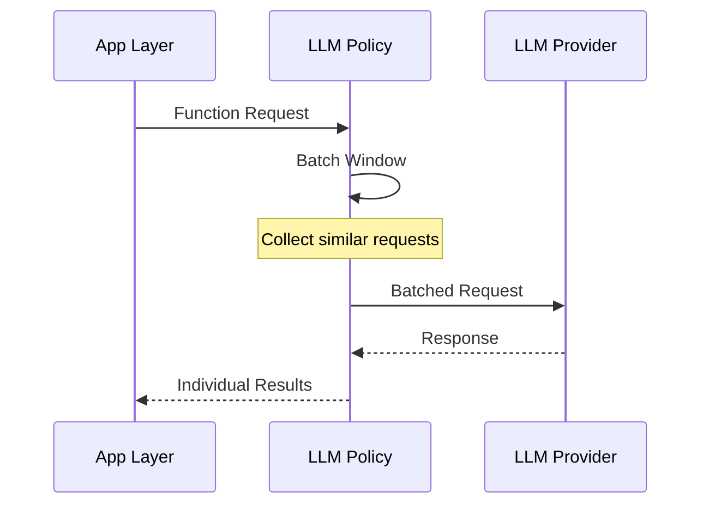

# LLM Policy

## You'll learn

-   LLM provider configuration and selection
-   Request batching and deduplication
-   Error handling and retry policies

## Where this lives in hex

Infrastructure layer; manages LLM interactions and policies.

## Provider Configuration

### Provider Selection

-   [ ] TODO: Document provider options
-   [ ] TODO: Document model selection criteria

### API Configuration

-   [ ] TODO: Document API key management
-   [ ] TODO: Document rate limits

## Request Management

### Batching Strategy

### Deduplication

-   [ ] TODO: Document deduplication logic
-   [ ] TODO: Document caching strategy

## Error Handling

### Retry Policy

-   [ ] TODO: Document retry conditions
-   [ ] TODO: Document backoff strategy

### Fallback Behavior

-   [ ] TODO: Document fallback options
-   [ ] TODO: Document degraded modes

## Performance Optimization

### Request Optimization

-   [ ] TODO: Document prompt optimization
-   [ ] TODO: Document token management

### Cost Management

-   [ ] TODO: Document cost tracking
-   [ ] TODO: Document budget controls

## Monitoring

### Performance Metrics

-   [ ] TODO: Document latency tracking
-   [ ] TODO: Document success rates

### Cost Metrics

-   [ ] TODO: Document token usage
-   [ ] TODO: Document cost tracking

## Development and Testing

### Local Development

-   [ ] TODO: Document mock LLM setup
-   [ ] TODO: Document testing tools

### Integration Testing

-   [ ] TODO: Document test scenarios
-   [ ] TODO: Document validation approach
