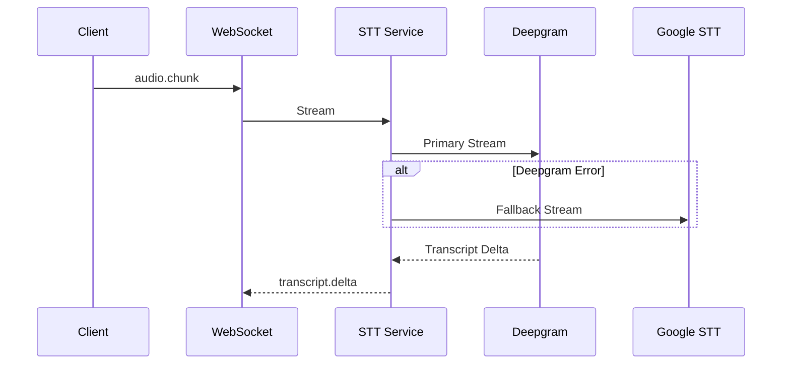

# Speech-to-Text Infrastructure

## You'll learn

-   STT provider configuration and fallback strategy
-   Stream handling and error management
-   Performance optimization and caching

## Where this lives in hex

Infrastructure layer; provides speech-to-text capabilities via external services.

## Provider Configuration

### Primary Provider (Deepgram)

-   Configuration via `DEEPGRAM_API_KEY` environment variable
-   Used as the primary STT service
-   Streaming support for real-time transcription
-   Word-level timing and confidence scores

### Fallback Provider (Google)

-   Configuration via `GOOGLE_STT_CREDENTIALS` JSON
-   Used as fallback when Deepgram is unavailable
-   Supports batch and streaming modes
-   Multi-language support

## Stream Processing

### Audio Stream Handling



### Transcript Data Model

Based on the database schema:

```sql
transcripts {
    id uuid PK
    session_id uuid FK
    text text
    is_final boolean
    confidence float4
    stability float4
    chunk_dur_sec float8
    channel int
    words jsonb
    turns jsonb
}
```

### Performance Optimization

#### Caching Strategy

1. **Session-Level Cache**

    - Active session transcripts
    - Recent word timings
    - Speaker diarization data

2. **Configuration Cache**
    - Provider settings
    - Language models
    - API credentials

#### Resource Management

1. **Connection Pooling**

    - Managed gRPC connections
    - Connection retry policies
    - Health checking

2. **Stream Cleanup**
    - Automatic resource release
    - Idle session termination
    - Error state recovery

## Error Handling

### Common Errors

1. **Provider Errors**

    - Connection failures
    - API rate limits
    - Invalid credentials

2. **Stream Errors**
    - Audio format issues
    - Network interruptions
    - Timeout conditions

### Recovery Strategies

1. **Provider Fallback**

    - Automatic failover to Google
    - Session state preservation
    - Transcript merging

2. **Stream Recovery**
    - Automatic reconnection
    - Backoff policies
    - State reconciliation

## Monitoring

### Metrics

1. **Performance Metrics**

    - Latency by provider
    - Error rates
    - Fallback frequency

2. **Quality Metrics**
    - Confidence scores
    - Word error rates
    - Speaker detection accuracy

### Health Checks

1. **Provider Health**

    - API availability
    - Response times
    - Error patterns

2. **Resource Health**
    - Memory usage
    - Connection pools
    - Stream states

## Development and Testing

### Local Development

1. **Mock Providers**

    - Simulated responses
    - Error injection
    - Latency simulation

2. **Test Data**
    - Sample audio files
    - Expected transcripts
    - Error scenarios

### Integration Testing

1. **Provider Tests**

    - API compatibility
    - Error handling
    - Fallback behavior

2. **Stream Tests**
    - Long-running sessions
    - Concurrent streams
    - Resource cleanup

## Configuration Reference

### Environment Variables

```yaml
DEEPGRAM_API_KEY: Required for primary STT
  - Format: API key string
  - Default: None
  - Required: Yes

GOOGLE_STT_CREDENTIALS: Required for fallback
  - Format: JSON credentials file
  - Default: None
  - Required: No
```

### Provider Settings

```yaml
deepgram:
    model: enhanced
    language: en-US
    interim_results: true
    punctuate: true
    diarize: true

google:
    language: en-US
    model: command_and_search
    enable_word_time_offsets: true
    enable_automatic_punctuation: true
```
