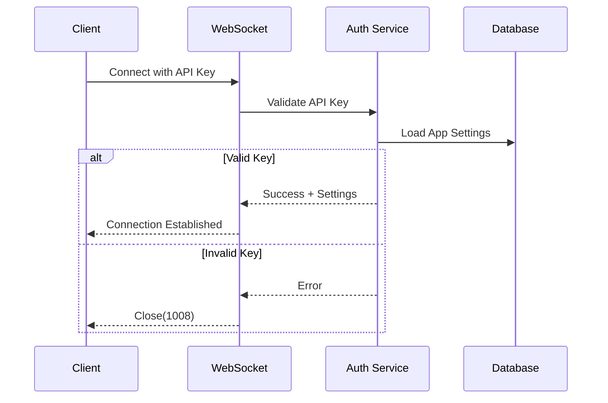
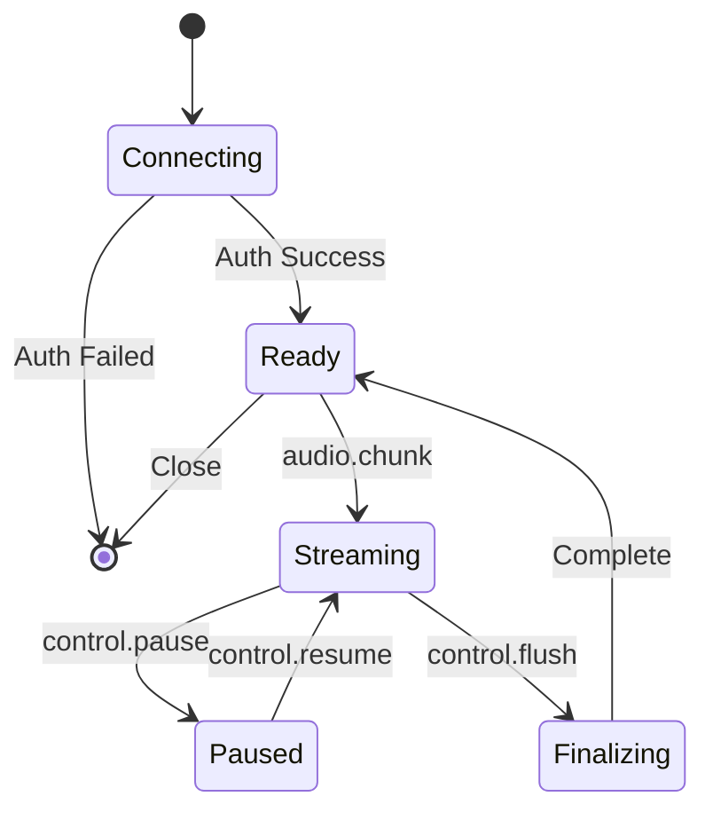

# WebSocket Transport

## You'll learn

-   Message contract (in/out)
-   Heartbeats, backpressure, and close codes
-   Mapping to app use-cases

## Where this lives in hex

Transport shell; maps DTOs to domain/app.

## Connect & Auth

### Authentication Flow



### API Key Handling

-   Location: Header `X-API-Key` or query param `api_key`
-   Validation: Maps to AccountID/AppID
-   Caching: App settings cached after validation

## Messages (Inbound)

### Audio Chunk

```json
{
    "type": "audio.chunk",
    "sessionId": "uuid",
    "seq": 123,
    "bytes": "base64-encoded"
}
```

### Control Messages

```json
{
    "type": "control",
    "action": "pause|resume|flush",
    "sessionId": "uuid"
}
```

### Schema Updates

```json
{
    "type": "schema.update",
    "tools": [
        {
            "name": "string",
            "description": "string",
            "parameters": {}
        }
    ]
}
```

## Events (Outbound)

### Transcript Delta

```json
{
    "type": "transcript.delta",
    "sessionId": "uuid",
    "text": "string",
    "seq": 123
}
```

### Function Events

```json
{
    "type": "function.draft|function.final",
    "sessionId": "uuid",
    "functionId": "uuid",
    "content": {
        // Function-specific content
    }
}
```

### Error Events

```json
{
    "type": "error",
    "code": "string",
    "message": "string",
    "details": {}
}
```

## State Machine



## Close Codes

| Code | Description      | Reconnect? |
| ---- | ---------------- | ---------- |
| 1000 | Normal closure   | Yes        |
| 1008 | Policy violation | No         |
| 1011 | Internal error   | Yes        |

## Backpressure Handling

### Client-side

-   Monitor `bufferedAmount`
-   Pause sending on threshold
-   Resume on buffer drain

### Server-side

-   Queue monitoring
-   Back-pressure signals
-   Rate limiting

## Error Handling

### Common Errors

-   Authentication failures
-   Rate limit exceeded
-   Invalid message format
-   Session not found

### Recovery Strategies

-   Automatic reconnection
-   Session recovery
-   Message redelivery

## AsyncAPI Specification

See: [AsyncAPI Spec](../../references/ws-asyncapi.yaml)

## Development Tools

### Testing

-   [ ] TODO: Document WebSocket test utilities
-   [ ] TODO: Document mock client implementation

### Debugging

-   [ ] TODO: Document debugging tools
-   [ ] TODO: Document common issues

## Refactor Tickets

-   [ ] Move business logic from WS handlers to app use-cases
-   [ ] Implement proper DTO mappers in `transport/ws/dto`
-   [ ] Add comprehensive connection metrics
