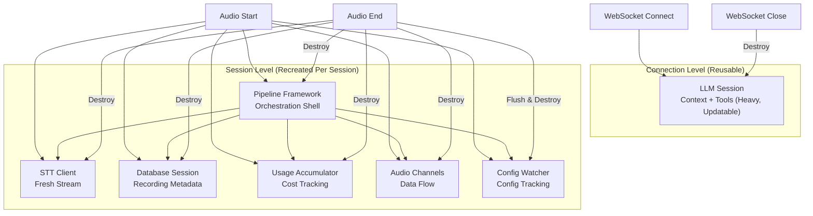
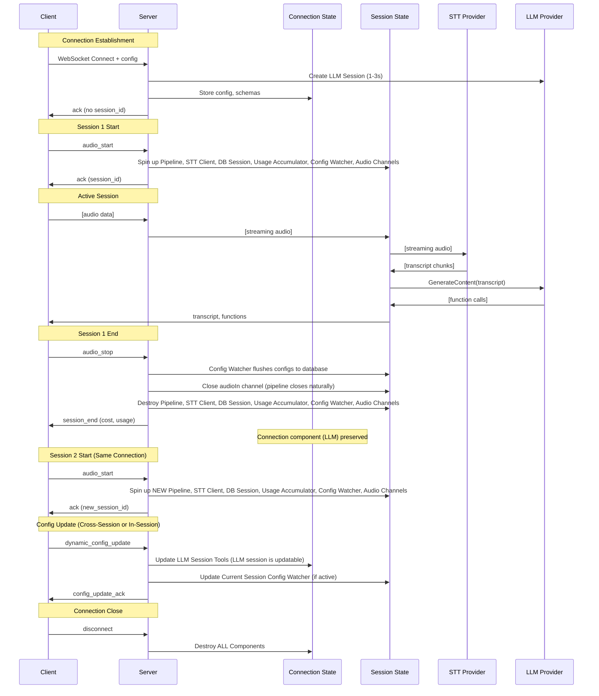

# Persistent WebSocket Sessions - Simplified Architecture

## Overview

This feature enables a single WebSocket connection to support multiple consecutive audio sessions without reconnection. The architecture is simplified with clear separation between connection-level and session-level components, orchestrated by the WebSocket handler.

## Architecture Principles

### Connection-Level Components (Reusable)

- **Lifetime**  : Once per WebSocket connection, reused across sessions
- **Components**: **LLM Session** (heavy), **logger** (package-level singleton)
- **Rationale** : Expensive to create but safe for long-term reuse; LLM tools can be hot-swapped.

### Session-Level Components (Recreated Per Session)

- **Lifetime** : Per audio session (`audio_start` ➜ `audio_stop`)
- **Components**: `liveSession` bundle → Pipeline, STT client, DB session, Usage Accumulator, **SilenceService** (with keep-alive), Ring-buffer, Config Watcher, channels.
- **Teardown** : Closed by calling `liveSession.stop(ctx)` which idempotently closes audio, timers, accumulators and persists aggregates.

## Component Analysis & Rationale

### Why LLM Session is Connection-Level ✅

```go
// LLM uses stateless HTTP requests with preserved context
llmSession.GenerateContent(prompt) // Single HTTP call
```

**Characteristics:**

-   **Connection Pattern**: Request/response, no persistent streams
-   **State**: Holds conversation context + tool configurations
-   **Reliability**: Self-healing (each request establishes fresh HTTP connection)
-   **Setup Cost**: 1-3 seconds (expensive)
-   **Memory**: 10-30MB
-   **Edge Cases**: Minimal (standard HTTP timeouts only)
-   **Updatable**: The LLM session is updatable by the config watcher, allowing config/tool changes within or between sessions.

### Why Pipeline & Session Components are Session-Level ✅

```go
// Pipeline and all session-level components are spun up per session
func startSession() {
    pipeline := pipeline.New(...)
    sttClient := sttFactory.CreateSTTClient(...)
    dbSession := db.NewSession(...)
    usageAccumulator := usage.NewAccumulator(...)
    configWatcher := configwatcher.New(...)
    audioIn := make(chan speech.AudioChunk, ...)
    // ...
    go pipeline.Run(audioIn, ...)
}

// To close the pipeline and session, close the upstream audio channel
close(audioIn) // triggers pipeline and session teardown
```

**Characteristics:**

-   **Connection Pattern**: Streaming, stateful, short-lived
-   **State**: Active only during session
-   **Reliability**: Fresh per session, isolates errors/timeouts
-   **Setup Cost**: 100-300ms (lightweight)
-   **Memory**: 1-5MB per session
-   **Lifecycle**: Created on `audio_start`, destroyed on `audio_stop` (or when pipeline naturally closes)

## Component Lifecycle



## State Management Strategy

### Data Structures

```go
type ConnectionState struct {
    // Reusable component (heavy, updatable)
    LLMSession      *llmgemini.Session           // Conversation context + tools
    // Configuration state (persists across sessions)
    FunctionSchemas []speech.FunctionDefinition // Latest schema config
    ParsingGuide    string                      // Latest prompt config
    Config          ConfigMessage               // Original client config
    // Current session state
    CurrentSession  *SessionState
    Principal       *http_middleware.Principal
    mu              sync.RWMutex
}

type SessionState struct {
    // Session identity
    ID               string
    DBSession        db.Session
    // Fresh streaming components (recreated per session)
    Pipeline         *pipeline.Pipeline          // Orchestration framework
    STTClient        speech.STTClient           // Fresh STT stream
    UsageAccumulator *usage.Accumulator         // Session cost tracking
    ConfigWatcher    configwatcher.ConfigWatcher // Config tracking
    AudioIn          chan speech.AudioChunk     // Audio pipeline
    // Pipeline channels (session-specific)
    OutTr            <-chan speech.Transcript
    OutFn            <-chan []speech.FunctionCall
    OutDr            <-chan speech.FunctionCall
    // Lifecycle management
    Done             chan struct{}
    WriterClosed     chan struct{}
    // State tracking
    IsActive         bool
    StartTime        time.Time
}
```

## Session Lifecycle Flow



## Error Handling & Reliability

### STT & Pipeline Error Recovery (Session-Level)

```go
func startSession() error {
    // Spin up all session-level components
    pipeline := pipeline.New(...)
    sttClient := sttFactory.CreateSTTClient(...)
    configWatcher := configwatcher.New(...)
    // ...
    go pipeline.Run(audioIn, ...)
    // ...
    // To close: close(audioIn)
}
```

### LLM Error Recovery (Connection-Level)

```go
func (cs *ConnectionState) handleLLMError(err error) {
    // LLM errors are typically temporary
    // Next GenerateContent() call will work
    // No persistent connection to recover
    log.Printf("LLM request failed (will retry): %v", err)
}
```

### Cross-Session & In-Session Config Updates

```go
func (cs *ConnectionState) updateFunctionConfigs(newConfig speech.FunctionConfig) {
    cs.mu.Lock()
    defer cs.mu.Unlock()

    // Update connection-level state for future sessions
    cs.FunctionSchemas = newConfig.Declarations
    cs.ParsingGuide = newConfig.ParsingGuide
    cs.LLMSession.UpdateTools(newConfig.Declarations) // LLM session is updatable

    // Update current session if active
    if cs.CurrentSession != nil && cs.CurrentSession.IsActive {
        cs.CurrentSession.ConfigWatcher.UpdateSessionConfig(ctx, cs.CurrentSession.ID, newConfig)
    }
}
```

## Performance Characteristics

### Memory Usage (Per Connection)

-   **Connection-Level**: ~10-30MB (LLM session)
-   **Session-Level**: ~5-15MB (Pipeline, STT client, channels, tracking, config watcher)
-   **Total Peak**: ~15-45MB per connection
-   **Between Sessions**: ~10-30MB (session components destroyed)

### Latency Profile

-   **Connection Setup**: 1-3 seconds (one-time cost)
-   **Session Start**: 100-300ms (pipeline + STT creation)
-   **Config Updates**: 200-500ms (LLM/draft index update)
-   **Session End**: <50ms (cleanup only)

### Reliability Benefits

1. **STT Quality**: Fresh connection every session, no staleness
2. **Error Isolation**: STT/pipeline failures only affect current session
3. **Simplified Recovery**: No complex stream management
4. **Predictable Performance**: Fewer edge cases and timeouts

## Migration Strategy

### Phase 1: Simplified Foundation

-   Implement connection/session state separation
-   Move pipeline and STT creation to session-level
-   Add config watcher per session
-   Keep LLM at connection-level

### Phase 2: Session Control Protocol

-   Add audio_start/audio_stop message handling
-   Implement session lifecycle management (pipeline spin up/down)

### Phase 3: Config Persistence

-   Update config watcher for simplified architecture
-   Add cross-session and in-session config state management

### Phase 4: Client SDK Updates

-   Add session control methods
-   Handle new session lifecycle events

## Benefits Summary

1. **Performance**: ~2s faster session start (vs full recreation)
2. **Reliability**: Fresh pipeline/STT connections, no timeout edge cases
3. **Memory Efficiency**: Reuse expensive LLM component
4. **Maintainability**: Simpler error handling for STT/pipeline
5. **User Experience**: Fast session transitions with reliable audio quality
6. **Simplified Architecture**: WebSocket handler orchestrates everything

This simplified approach optimizes for both **real-time performance** (fast session starts) and **reliability** (fresh pipeline/STT connections), giving the best of both architectural strategies while maintaining clear separation of concerns.
