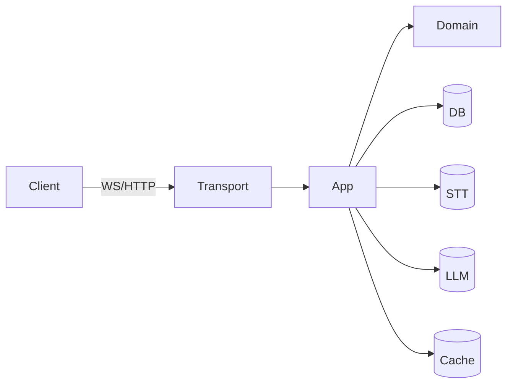

# Cursor Prompt — Rebuild Server Docs (Hex Architecture, Code‑Mined, Legacy‑Aware)

## 🤖 Role

You are a **repo-aware documentation refactor assistant**. Work **only inside the current repository** (server directory is the root for code introspection). Produce **accurate, minimal, and up-to-date** docs that mirror the project’s **hexagonal architecture**:

-   `domain/` → core types, rules, policies (pure, no I/O)
-   `app/` → orchestration & use-cases (session manager, flows)
-   `infra/` → adapters to real-world (DB, STT, cache, metrics, LLM)
-   `transport/` → thin shells (WebSocket/gRPC/HTTP) mapping DTOs ↔ domain
-   `pkg/` → SDK-like utilities

The repo already has **legacy docs** under `docs/_legacy/` (read-only). You **may copy/merge text**, but **do not modify or delete** anything inside `_legacy`.

## 🎯 Objectives

1. Create a **clean, hex-aligned** docs tree under `docs/`.
2. **Generate** references from live code (gomarkdoc), DB (Atlas), and protocols (AsyncAPI/OpenAPI).
3. **Mine** `docs/_legacy/**` for high-signal content, merging selectively per mapping rules.
4. Call out **inconsistencies** with the architecture and raise **refactor tickets**.
5. Provide a **leftover report** of legacy pages not merged.

## 📥 Inputs & Signals

-   Source code under the current directory (`domain`, `app`, `infra`, `transport`, `pkg`).
-   Legacy docs under `docs/_legacy/**`.
-   Optional mapping file at `docs/_legacy/map.yaml`. If missing, infer sensible targets.

## 🧭 Output Structure (create these files; keep pages concise)

```
docs/
  00-overview/
    architecture.md
    runtime-lifecycle.md
    decisions/ADR-0001-hex-architecture.md
  10-domain/
    README.md
  20-app/
    session-manager.md
    orchestration-policies.md
  30-infra/
    db.md
    stt.md
    cache.md
    observability.md
    llm-policy.md
  40-transport/
    websocket.md
  50-pkg/
    README.md
  60-observability/
    metrics.md
    logging.md
    tracing.md
  70-ops/
    running-locally.md
    env-vars.md
    deploy.md
    backups-and-dr.md
  80-testing/
    strategy.md
    fixtures-and-fakes.md
    load-and-profiling.md
  90-guides/
    add-stt-provider.md
    add-function-schema.md
    consume-ws-from-sdk.md
    interpret-usage-metrics.md
  references/
    packages.md                 # gomarkdoc output (single file)
    schema/
      schema.sql                # atlas inspect output
    ws-asyncapi.yaml            # derived from transport/ws handler(s)
    ws-asyncapi.html            # rendered (if template in repo)
    http-openapi.yaml           # only if HTTP present; else omit
```

## 🧱 Scaffolding Rules

-   Use this frontmatter for top-level pages:

    ```md
    ---
    audience: engineers
    status: draft
    last_verified: { { TODAY } }
    ---
    ```

-   Each page begins with **“Audience”**, **“You’ll learn”**, and **“Where this lives in hex”** (one sentence).
-   Prefer **Mermaid** diagrams where helpful. Keep them small.

## 🔌 Generators & Makefile (create/update)

Add/update a `Makefile` with:

```make
docs-seed:
	@mkdir -p docs/references/schema
	# Generate package docs
	gomarkdoc ./... -o docs/references/packages.md
	# Inspect DB schema
	@if [ -n "$$DATABASE_URL" ]; then atlas schema inspect -u $$DATABASE_URL > docs/references/schema/schema.sql; else echo "DATABASE_URL not set; skipping atlas inspect"; fi

docs-validate:
	@echo "Run link checks & basic sanity (optional lychee)"
	# lychee --offline --config .lychee.toml docs || true

docs-build: docs-seed docs-validate
	@echo "Docs build complete"
```

If a `Makefile` exists, **append** these targets (don’t clobber existing ones). Otherwise, create it.

## 🧾 Legacy Merge Policy

-   If `docs/_legacy/map.yaml` exists, use it:

    ```yaml
    mappings:
        - legacy: "_legacy/architecture.md"
          target: "00-overview/architecture.md"
          strategy: "merge"
        - legacy: "_legacy/ws-protocol.md"
          target: "40-transport/websocket.md"
          strategy: "append-section:Compatibility notes"
        - legacy: "_legacy/db/schema-notes.md"
          target: "30-infra/db.md"
          strategy: "prefer-target"
    ```

-   If no map exists, **infer** targets:

    -   Match on keywords: `ws|websocket` → `40-transport/websocket.md`; `schema|sql|atlas` → `30-infra/db.md`; `stt|deepgram|google` → `30-infra/stt.md`; `deploy|fly|k8s|prod` → `70-ops/deploy.md`; etc.
    -   **Never** replace newly written sections; append as **“Legacy Notes (To be verified)”**.

-   For every merged page, keep a **provenance footer**:

    ```
    ---
    Source(s) merged: docs/_legacy/XYZ.md (confidence: medium, last_verified: 2024-..)
    ---
    ```

## 🔎 Code Mining Tasks (read code first)

1. **Hex sanity**: build an import map for `domain`, `app`, `infra`, `transport`, `pkg`. Identify violations (e.g., domain importing infra). List them in `00-overview/architecture.md` under **“Import-graph violations”** with file\:line references.
2. **App/session manager**: from `app` code, document `Start`, `Advance`, `AddUsage`, `Snapshot`, `Close` + invariants, idempotency, and failure modes in `20-app/session-manager.md`. Include a **Mermaid sequence** of the WS flow.
3. **Transport/WebSocket**: parse `transport/ws/**` to enumerate:

    - Inbound message types (audio chunk/control/schema updates)
    - Outbound events (transcript deltas, draft functions, final functions, errors)
    - Auth handshake, heartbeats, close codes, rate limits, backpressure
      Put a **message catalog** and a **state machine** in `40-transport/websocket.md`.

4. **AsyncAPI**: synthesize `docs/references/ws-asyncapi.yaml` from the catalog (channels, messages, payload schemas). If uncertain fields exist, mark `// TODO: confirm`.
5. **Infra/DB**: summarize Atlas/sqlc packages and how migrations are applied in `30-infra/db.md`. Link to `schema.sql`. If tables related to sessions, apps, usage, events exist, include a short **ERD Mermaid** (class diagram) derived from table names/foreign keys (do not hand-wave—reflect actual code).
6. **Infra/STT+LLM**: document provider selection (Deepgram primary, Google fallback), config keys, timeouts, retry policy, and the **decision policy** for LLM calls (when, batching, dedupe). Place in `30-infra/stt.md` and `30-infra/llm-policy.md`.
7. **Observability**: mine metric names, log keys, and tracing spans. List them in `60-observability/metrics.md`, `logging.md`, `tracing.md`. Include example queries if Prometheus present.
8. **Ops**: enumerate env vars from code (central config if present; otherwise scan). Create `70-ops/env-vars.md` with a table: `NAME | Type | Default | Required | Description`. Add `running-locally.md` and `deploy.md` with concrete commands already used in the repo (Docker/Fly/etc.).
9. **Testing**: scan for testing packages, fakes, fixtures. If k6/Vegeta or profiling scripts exist, document them in `80-testing/*`. If not present, create **stubs** with TODOs.

## 🧩 Content Style & Constraints

-   **Authoritative but terse**. Prefer lists and small diagrams.
-   **No speculation**: if something is unclear in code, add `> TODO: Confirm …` with a short question.
-   **Keep transport thin**: if business logic is found in WS handlers, document it under **“Refactor Tickets”** in `40-transport/websocket.md`.
-   **Do not** change code (only docs and Makefile), unless adding `docs/` files or the AsyncAPI/OpenAPI spec.

## 🧾 Page Templates (use these when creating content)

**`00-overview/architecture.md`**

````md
---
audience: engineers
status: draft
last_verified: { { TODAY } }
---

# Architecture Overview

## You’ll learn

-   How the hexagonal boundaries are enforced.
-   What each layer owns and depends on.
-   Known deviations and planned refactors.

## Where this lives in hex

Repository-wide; applies to domain/app/infra/transport/pkg.

## System Context (Mermaid)


````

## Allowed Dependencies

-   domain: imports none outside stdlib
-   app: imports domain
-   infra: imports domain (adapters), may be imported by app
-   transport: imports app (use-cases) and DTO mappers
-   pkg: utility, no business rules

## Import-graph violations

-   [ ] TODO: List file\:line and brief fix

## Key Decisions

-   Link: `../decisions/ADR-0001-hex-architecture.md`

````

**`20-app/session-manager.md`**
```md
---
audience: engineers
status: draft
last_verified: {{TODAY}}
---
# Session Manager

## You’ll learn
- Use-cases (`Start`, `Advance`, `AddUsage`, `Snapshot`, `Close`).
- Invariants, retries, and idempotency.
- Sequence across WS events.

## Where this lives in hex
App layer orchestration.

## Ports and Methods
- Start(...): ...
- Advance(...): ...
- AddUsage(...): ...
- Snapshot(...): ...
- Close(...): ...

## Sequence (connect → close)
```mermaid
sequenceDiagram
  participant C as Client
  participant T as Transport(WS)
  participant A as App(Session Manager)
  participant STT as STT Provider
  participant LLM as LLM
  participant DB as DB

  C->>T: Connect + API Key
  T->>A: Authenticate(AppID)
  A->>DB: Load AppSettings (cached)
  T->>A: AudioChunk / Control
  A->>STT: Stream
  STT-->>A: Transcript delta
  A->>LLM: Function finalization (policy)
  A-->>T: Draft/Final events
  A->>DB: Usage + EventLog
  C-->>T: Close
  T->>A: Close(Session)
````

## Failure Modes & Policies

-   Rate limit (AppID): ...
-   Backpressure: ...
-   Retries (STT/LLM/DB): ...
-   Idempotency keys: ...

````

**`40-transport/websocket.md`**
```md
---
audience: engineers
status: draft
last_verified: {{TODAY}}
---
# WebSocket Transport

## You’ll learn
- Message contract (in/out).
- Heartbeats, backpressure, and close codes.
- Mapping to app use-cases.

## Where this lives in hex
Transport shell; maps DTOs to domain/app.

## Connect & Auth
- API key header/query: ...
- Maps to AccountID/AppID: ...

## Messages (Inbound)
- audio.chunk { sessionId, seq, bytes }  // TODO: confirm field names
- control.pause { ... }
- schema.update { tools: [...] }

## Events (Outbound)
- transcript.delta { ... }
- function.draft { ... }
- function.final { ... }
- error { code, message }

## State Machine
```mermaid
stateDiagram-v2
  [*] --> Connecting
  Connecting --> Ready
  Ready --> Streaming : audio.chunk
  Streaming --> Finalizing : control.flush
  Finalizing --> Ready
  Ready --> [*] : close
````

## AsyncAPI

See: `../../references/ws-asyncapi.yaml` (generated)

## Refactor Tickets

-   [ ] Business logic in WS handler → move to `app` use-cases.
-   [ ] DTO mappers in `transport/ws/dto` (no domain ↔ transport imports).

````

*(Apply similar templates to other pages.)*

## 🧾 AsyncAPI Seed (create `docs/references/ws-asyncapi.yaml`)
If you detect WS usage, synthesize a minimal spec from code:

```yaml
asyncapi: '2.6.0'
info:
  title: Schma WebSocket API
  version: '0.1.0'
defaultContentType: application/json
channels:
  ws/events:
    subscribe:
      message:
        oneOf:
          - $ref: '#/components/messages/TranscriptDelta'
          - $ref: '#/components/messages/FunctionDraft'
          - $ref: '#/components/messages/FunctionFinal'
          - $ref: '#/components/messages/Error'
    publish:
      message:
        oneOf:
          - $ref: '#/components/messages/AudioChunk'
          - $ref: '#/components/messages/Control'
          - $ref: '#/components/messages/SchemaUpdate'
components:
  messages:
    TranscriptDelta:
      name: transcript.delta
      payload:
        type: object
        properties:
          sessionId: { type: string, format: uuid }
          text: { type: string }
          seq: { type: integer }
    # TODO: Fill in remaining messages from code parsing
````

## 📝 Env Var Table Schema (use in `70-ops/env-vars.md`)

```
| NAME | Type | Default | Required | Description |
|------|------|---------|----------|-------------|
| SCHMA_API_PORT | int | 8080 | yes | WS server port |
| DEEPGRAM_API_KEY | string | — | yes | STT provider key |
| GOOGLE_STT_CREDENTIALS | json | — | no | Fallback STT |
| ... | ... | ... | ... | ... |
```

_(Populate by scanning config code; mark unknowns as TODO.)_

## 🐞 Refactor Ticket Sink

Create `docs/_tickets.md` with checkboxes. Add items when you detect:

-   Transport layer logic that belongs in app/domain.
-   Domain importing infra/transport.
-   Env lookups in app/domain (should be injected).
-   Missing DTO mappers.

## 📋 Acceptance Criteria

-   New `docs/` tree exists with all files listed above.
-   `Makefile` has `docs-seed`, `docs-validate`, `docs-build`.
-   `docs/references/packages.md` generated stub present (even if empty pre-run).
-   `docs/references/schema/schema.sql` exists or page explains why not (no `DATABASE_URL`).
-   `docs/references/ws-asyncapi.yaml` exists with at least 3 concrete messages inferred from code.
-   Each major page contains **explicit TODOs** where code was inconclusive.
-   `docs/_legacy/LEFTOVERS.md` created listing legacy files not merged, with suggested targets.

## 🚧 Safety & Non-Destructive Rules

-   Do **not** edit or delete anything in `docs/_legacy/**`.
-   Do **not** modify code outside `docs/**` and `Makefile`.
-   When unsure, prefer adding a **TODO** over guessing.

---

**Now perform the plan.** Create/modify the files as specified, mine code and `docs/_legacy/**`, synthesize the AsyncAPI, generate package/schema references, and produce the leftover report.
